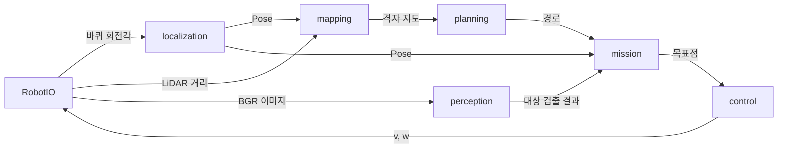

# 코드 구조

sar-robot의 폴더 구성, 모듈 사이 데이터 흐름, 구조를 선택한 이유를 설명하는 문서입니다. 함수 형식은 [모듈 인터페이스](../reference/interfaces.md)에 있습니다.

## 폴더 구성

```text
sar-robot/
├── controllers/sar_mission/   팀 미션 컨트롤러
├── controllers/tb3_*/         Intro 실습 컨트롤러 8개 (원본 유지)
├── scripts/                   Webots 에셋 캐시 스크립트
├── src/sar/                   팀 코드 패키지
│   ├── config.py              상수
│   ├── geometry.py            좌표 규칙, Pose, 좌표 변환
│   ├── robot_io.py            Webots 장치 접근
│   └── localization/          Wheel Odometry
├── tests/                     pytest
├── worlds/*.wbt               Intro 실습 월드 7개
├── worlds/sar_dev.wbt         개발용 월드 (Intro breakroom_teleop_yolo 복사본)
├── worlds/webots_assets.txt   개발용 월드의 원격 에셋 URL 목록
├── protos/                    목표 물체 사과 PROTO 4종
└── models/YOLO/               YOLO 가중치 (Git 제외)
```

`mapping/`, `planning/`, `perception/`, `control/`, `mission/` 폴더는 기능을 구현할 때 추가합니다. 담당 역할은 [역할과 담당 범위](https://github.com/Tech-Week-2026-KimEPark/docs/blob/main/human/reference/team/roles.md)에 있습니다.

## 데이터 흐름

미션 루프는 인지·계획·행동 순서로 1 step을 처리합니다.



현재 구현된 흐름은 `RobotIO → localization`과 로그 출력입니다. 컨트롤러는 바퀴 속도 0을 유지합니다.

## 구조 선택 이유

### 컨트롤러와 패키지 분리

Webots는 `controllers/<이름>/<이름>.py`를 실행합니다. 로직을 이 파일에 작성하면 Webots 없이 테스트할 수 없습니다. 팀 코드는 `src/sar/` 패키지에 작성하고 컨트롤러는 루프만 담당합니다. `from controller import ...`는 `robot_io.py`에만 두므로 나머지 모듈은 pytest와 CI에서 실행됩니다.

### Webots Python과 패키지 등록

Intro 과정은 Webots와 노트북이 같은 Python 3.10 환경을 사용합니다. sar-robot도 같은 구조를 사용합니다. Webots Preferences의 Python command를 저장소 `.venv`의 Python으로 설정하면 Intro 실습 컨트롤러와 팀 컨트롤러가 같은 패키지 버전으로 실행됩니다.

팀 코드는 `pip install -e .`로 가상환경에 등록합니다. 컨트롤러 폴더 위치와 관계없이 `from sar import ...`가 동작하므로 컨트롤러에 import 경로 설정 코드가 필요하지 않습니다.

Webots의 `runtime.ini`는 사용하지 않습니다. `[python] COMMAND`는 상대 경로를 인식하지 않습니다(Webots R2025a에서 `"../../.venv/bin/python" was not found` 확인). 절대 경로는 PC마다 다르므로 저장소에 포함할 수 없습니다.

### 원격 에셋 사전 캐시

실습 월드는 Webots 기본 PROTO와 텍스처를 GitHub에서 내려받습니다. Webots R2025a의 Qt 6.5.3은 이 다운로드에서 HTTP/2 헤더 압축 오류(`error code: 399`)가 발생합니다. 같은 파일을 curl의 HTTP/2 요청으로 받으면 정상 수신되므로 서버가 아니라 Qt 구현의 문제입니다. Webots는 캐시 폴더에 URL의 SHA1 이름으로 파일이 있으면 네트워크 요청을 하지 않습니다. `scripts/prefetch_webots_assets.py`는 이 규칙에 맞춰 에셋을 HTTP/1.1로 미리 저장합니다.

### 모듈별 폴더

역할 4개가 서로 다른 폴더를 수정하므로 머지 충돌이 줄어듭니다. 모듈 사이 호출은 인터페이스 문서의 함수로 제한합니다. 따라서 담당자가 내부 구현을 바꿔도 다른 모듈을 수정하지 않습니다.

### 상수 파일 1개

속도, 임계값, 장치 이름을 `config.py` 1개에 모읍니다. 대회 월드의 장치 이름이나 로봇 크기가 다르면 이 파일만 수정합니다.

## 개발용 월드

`worlds/sar_dev.wbt`는 Intro의 `breakroom_teleop_yolo.wbt`에서 컨트롤러 이름만 `sar_mission`으로 바꾼 월드입니다. TurtleBot3 Burger에 카메라(640×480, 시야각 1.0472 rad)와 LDS-01 LiDAR가 장착되어 있고 사과 4종이 배치되어 있습니다. 대회 월드는 당일 제공되므로 이 월드는 개발·회귀 테스트용입니다.
