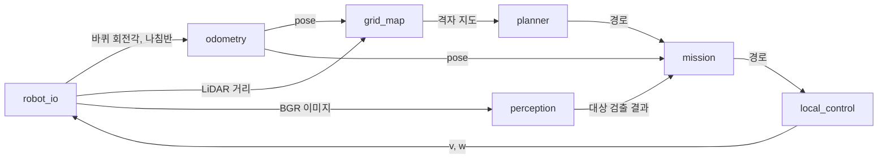

# 코드 구조

sar-robot의 폴더 구성, 모듈 사이 데이터 흐름, 구조를 선택한 이유를 설명하는 문서입니다. 함수 형식은 [모듈 인터페이스](../reference/interfaces.md)에 있습니다.

## 폴더 구성

```text
sar-robot/
├── controllers/sar_main/      팀 컨트롤러 (제출 단위)
│   ├── sar_main.py            Webots 진입점
│   └── sar/                   팀 코드 패키지
│       ├── config.py          모든 설정값
│       ├── mission.py         상태 머신, 모듈 통합, 나침반 보정
│       ├── robot_io.py        Webots 장치 접근
│       ├── odometry.py        엔코더 오도메트리, 방향 칼만 필터
│       ├── perception.py      대상 사과 검출, 거리·방위각, 연속 확인
│       ├── grid_map.py        점유 격자, 장애물 팽창, 프론티어
│       ├── planner.py         A* 경로, 다익스트라 프론티어 선택·복귀 거리 지도
│       ├── local_control.py   pure pursuit 경로 추종, 라이다 안전 필터
│       └── viz.py             지도·궤적·구조 위치 그림 저장
├── controllers/hsv_tuner/     HSV 임계값 튜닝 컨트롤러 (sar_main/sar 사용)
├── controllers/sar_eval/      설계 근거 측정 컨트롤러 (같은 Mission 실행, 실제 pose 기록)
├── controllers/tb3_*/         Intro 실습 컨트롤러 8개 (원본 유지)
├── scripts/                   Webots PROTO·에셋 사전 캐시, 경로 계획 성능 측정, 설계 근거 분석 스크립트
├── tests/                     pytest
├── worlds/*.wbt               Intro 실습 월드 7개
├── worlds/sar_apartment.wbt   검증 월드 (apartment.wbt 복사본, 컨트롤러 sar_main)
├── worlds/sar_apartment_eval.wbt  측정 월드 (sar_apartment.wbt + supervisor, 컨트롤러 sar_eval)
├── worlds/sar_dev.wbt         개발용 월드 (Intro breakroom_teleop_yolo 복사본). 검증에 사용하지 않음
├── protos/                    목표 물체 사과 PROTO 4종
└── models/YOLO/               YOLO 가중치 (Git 제외)
```

파일 구조의 원본은 docs [과제와 구현 기준](https://github.com/Tech-Week-2026-KimEPark/docs/blob/main/human/reference/sar-과제-구현-기준.md) 7장(`CONTEXT.md` 기준)입니다. 담당 역할은 [역할과 담당 범위](https://github.com/Tech-Week-2026-KimEPark/docs/blob/main/human/reference/team/roles.md)에 있습니다.

## 데이터 흐름

미션 루프는 인지·계획·행동 순서로 1 step을 처리합니다.



`sar_main.py`는 모듈을 생성하고 매 step `Mission.tick()`을 호출합니다. `tick()`은 센서 → 오도메트리 → 지도 → 인식(`YOLO_EVERY` step마다) → 상태 머신 → 안전 필터 → 구동 순서로 처리합니다. 인식 결과는 `Confirm`으로 확정한 뒤 접근 대상이 됩니다. 상태 머신은 docs [mission 기능 설명](https://github.com/Tech-Week-2026-KimEPark/docs/blob/main/human/explanation/features/mission.md)에 있습니다.

## 구조 선택 이유

### 컨트롤러 폴더 안의 패키지

Webots는 `controllers/<이름>/<이름>.py`를 실행하고 컨트롤러 폴더를 import 경로에 포함합니다. 팀 코드를 `controllers/sar_main/sar/`에 두면 `from sar import ...`가 별도 설치 없이 동작합니다. 컨트롤러 폴더 1개가 제출 단위가 되므로 평가 환경에서 패키지 설치 절차가 필요하지 않습니다.

로직을 진입점 파일에 작성하면 Webots 없이 테스트할 수 없습니다. 진입점 `sar_main.py`는 루프만 담당하고 로직은 `sar/` 모듈에 작성합니다. `from controller import ...`는 `robot_io.py`의 `RobotIO` 생성 시점에만 실행하므로 나머지 모듈과 `wheel_speeds()`는 pytest와 CI에서 실행됩니다. pytest는 `pyproject.toml`의 `pythonpath`로 Webots와 같은 import 경로를 사용합니다.

### Webots Python

Intro 과정은 Webots와 노트북이 같은 Python 3.10 환경을 사용합니다. sar-robot도 같은 구조를 사용합니다. Webots Preferences의 Python command를 저장소 `.venv`의 Python으로 설정하면 Intro 실습 컨트롤러와 팀 컨트롤러가 같은 패키지 버전으로 실행됩니다.

Webots의 `runtime.ini`는 사용하지 않습니다. `[python] COMMAND`는 상대 경로를 인식하지 않습니다(Webots R2025a에서 `"../../.venv/bin/python" was not found` 확인). 절대 경로는 PC마다 다르므로 저장소에 포함할 수 없습니다.

### 원격 에셋 사전 캐시

실습 월드는 Webots 기본 PROTO와 텍스처를 GitHub에서 내려받습니다. Webots R2025a의 Qt 6.5.3은 이 다운로드에서 HTTP/2 헤더 압축 오류(`error code: 399`)와 연결 종료(`error code: 2`)가 발생합니다. 같은 파일을 curl의 HTTP/2 요청으로 받으면 정상 수신되므로 서버가 아니라 Qt 구현의 문제입니다. Webots는 캐시 폴더에 URL의 SHA1 이름으로 파일이 있으면 네트워크 요청을 하지 않습니다. `scripts/prefetch_webots_assets.py`는 이 규칙에 맞춰 파일을 HTTP/1.1로 미리 저장합니다.

수집 대상은 월드 파일에서 시작해 재귀로 찾습니다.

| 대상 | 수집 방법 |
|---|---|
| PROTO | `EXTERNPROTO` 선언. 상대 경로는 선언한 PROTO의 URL 기준으로 변환 |
| 고정 이름 에셋 | 템플릿 밖의 `.jpg`, `.png`, `.hdr`, `.obj` 등 문자열 |
| 템플릿 이름 에셋 | `%<= '"textures/pavement/' + textureName + '_pavement_base_color.jpg"' >%` 같은 식에서 폴더와 이름 패턴을 추출하고 GitHub API 폴더 목록에서 일치하는 파일 전체 |

템플릿 변수 값은 월드마다 다르므로 폴더 안의 같은 패턴 파일을 모두 받습니다. 2026-09-30 기준 대상 폴더는 8개이며 폴더 전체 크기는 약 67 MB입니다.

### 기능별 파일

역할 4개가 서로 다른 파일을 수정하므로 머지 충돌이 줄어듭니다. 모듈 사이 호출은 인터페이스 문서의 함수로 제한합니다. 따라서 담당자가 내부 구현을 바꿔도 다른 모듈을 수정하지 않습니다.

### 상수 파일 1개

속도, 임계값, 장치 이름을 `config.py` 1개에 모읍니다. 대회 월드의 장치 이름이나 로봇 크기가 다르면 이 파일만 수정합니다.

## 검증 월드

`worlds/sar_apartment.wbt`는 대회 연습 맵 `apartment.wbt`에서 로봇 컨트롤러만 `sar_main`으로 바꾼 월드입니다. 빨간 사과 2개, 다른 색 사과, 방해 물체, 보행자가 과제 조건과 같습니다. Webots 동작 검증은 이 월드로만 수행합니다. `apartment.wbt`는 Intro 원본과 같아야 하므로(동기화 검사) 컨트롤러를 바꾼 복사본을 사용합니다.

`worlds/sar_dev.wbt`는 Intro의 `breakroom_teleop_yolo.wbt`에서 컨트롤러 이름만 `sar_main`으로 바꾼 월드입니다. TurtleBot3 Burger에 카메라(640×480, 시야각 1.0472 rad)와 LDS-01 LiDAR가 장착되어 있고 사과 4종이 배치되어 있습니다. 시작 위치가 `config.py`의 `START_*`와 다르고 빨간 사과가 1개뿐이라 검증에 사용하지 않습니다.
